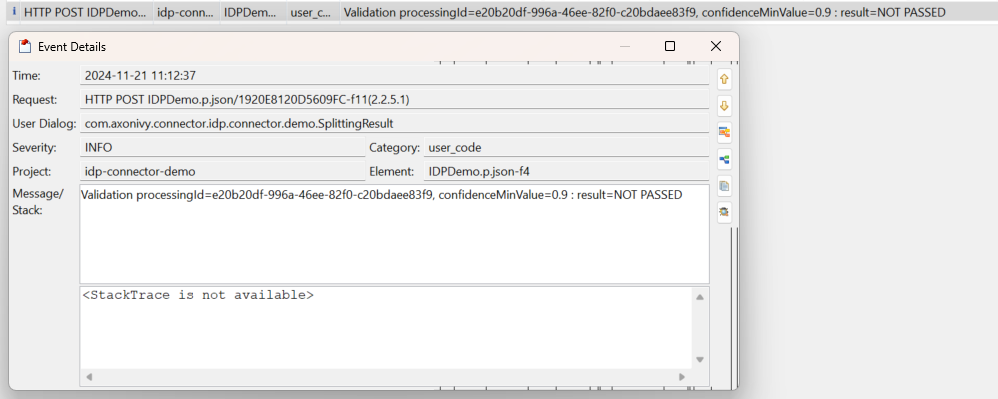
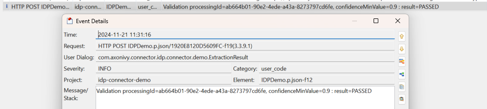

# Axon Ivy IDP Connector

Axon Ivy IDP is a powerful Intelligent Document Processing solution that automates the extraction, classification, and analysis of unstructured data, transforming document-intensive processes into streamlined, efficient workflows. It integrates with an IDP Document Capturing API and includes demo workflows for document splitting, extraction, and validation.

### Key features

- Automate document extraction to convert unstructured files into structured data for downstream systems.
- Split multi-page documents into sub-documents to enable targeted processing and retrieval.
- Review and validate extraction results using demo dialogs for quick corrections and quality control.
- Share processed documents securely via time-limited share tokens for controlled distribution.
- Connect to an IDP Document Capturing API through a configurable REST client for seamless integration.
- Run automated validation checks with configurable confidence thresholds and retry handling.

## Demo

Check the demo implementations in the `idp-connector-demo` module for hands‑on examples demonstrating the Document Splitting and Document Extraction workflows.

### Demo workflows

#### idp-connector-demo (idp-connector-demo)

##### Document Splitting
1. Launch the Document Splitting demo from the demo menu.

   

2. You'll see a File Selection dialog to choose the document to split.

   

3. Review the split results in the Splitting Result dialog and download the sub-documents.

   

4. Optionally share the resulting documents using the share token feature.

   

##### Document Extraction
1. Launch the Document Extraction demo from the demo menu.

   

2. Select a file and start the extraction process.

   

3. Review extracted fields and structured data in the Extraction Result dialog.

   

4. Optionally adjust validation confidence and re-run checks.

   

##### Log Workflow names (background utility)
1. Run the "Log Workflow names" demo to fetch available workflows from the configured IDP instance.
2. Results are written to the log for inspection by administrators.

## Setup

- **Roles:** Everybody (configured in config/roles.xml)
- **OpenAPI:** Namespace: `com.axonivy.connector.idp.connector.model` — Base URL: `${ivy.var.idpConnector.apiProxyUrl}/api`

### Variables

```yaml
Variables:
  idpConnector:
    # The proxy server URL
    apiProxyUrl: https://idp.api.axonivy.com
    # API Key for "IDP Document Capturing API"
    #[password]
    apiKeySecret: ${decrypt:}
    # Number of seconds to wait for the completion of document processing.
    # If processing doesn't finish in this time, a URL for retrieving the results will be returned.
    waitFor: "120"
    # The default value for validation processing result's confidence values  
    confidenceMinValue: "0.8"
```

- **Authentication:** Uses an API key configured in `idpConnector.apiKeySecret` (see `config/variables.yaml`).

- No information was delivered for this section.

## Components

### Connector Processes

#### ProcessingService.p.json

- **processing(String workfowId, java.io.File file) -> processingId: java.util.UUID, processingResult: com.fasterxml.jackson.databind.JsonNode, error: ch.ivyteam.ivy.bpm.error.BpmError**
    - Input:
        - `workfowId` (String) - 
        - `file` (java.io.File) - 
    - Result:
        - `processingId` (java.util.UUID) - 
        - `processingResult` (com.fasterxml.jackson.databind.JsonNode) - 
        - `error` (ch.ivyteam.ivy.bpm.error.BpmError) - 

- **getSubPdf(java.util.UUID processingId, Integer index, String fileName) -> file: java.io.File, error: ch.ivyteam.ivy.bpm.error.BpmError**
    - Input:
        - `processingId` (java.util.UUID) - 
        - `index` (Integer) - 
        - `fileName` (String) - 
    - Result:
        - `file` (java.io.File) - 
        - `error` (ch.ivyteam.ivy.bpm.error.BpmError) - 

- **shareToken(java.util.UUID processing_id, String expires_at) -> docShareTokenInfo: com.axonivy.connector.idp.connector.model.DocShareTokenInfo, error: ch.ivyteam.ivy.bpm.error.BpmError**
    - Input:
        - `processing_id` (java.util.UUID) - 
        - `expires_at` (String) - 
    - Result:
        - `docShareTokenInfo` (com.axonivy.connector.idp.connector.model.DocShareTokenInfo) - 
        - `error` (ch.ivyteam.ivy.bpm.error.BpmError) - 

- **revokeToken(java.util.UUID tokenUUID) -> error: ch.ivyteam.ivy.bpm.error.BpmError**
    - Input:
        - `tokenUUID` (java.util.UUID) - 
    - Result:
        - `error` (ch.ivyteam.ivy.bpm.error.BpmError) - 

- **retrieveThumbnail(java.util.UUID processingId) -> thumbnail: java.io.File, error: ch.ivyteam.ivy.bpm.error.BpmError**
    - Input:
        - `processingId` (java.util.UUID) - 
    - Result:
        - `thumbnail` (java.io.File) - 
        - `error` (ch.ivyteam.ivy.bpm.error.BpmError) - 

- **retrieveResult(java.util.UUID processingId) -> resultsNode: com.fasterxml.jackson.databind.JsonNode, error: ch.ivyteam.ivy.bpm.error.BpmError**
    - Input:
        - `processingId` (java.util.UUID) - 
    - Result:
        - `resultsNode` (com.fasterxml.jackson.databind.JsonNode) - 
        - `error` (ch.ivyteam.ivy.bpm.error.BpmError) - 

#### ValidationService.p.json

- **validate(java.util.UUID processingId, Double confidenceMinValue) -> passed: Boolean**
    - Input:
        - `processingId` (java.util.UUID) - 
        - `confidenceMinValue` (Double) - 
    - Result:
        - `passed` (Boolean) - 

### Form Components

#### IDPStandaloneUI — Runtime fields for the standalone UI used in demos
- **Namespace:** com.axonivy.connector.idp.connector.IDPStandaloneUI
- **Component type:** Data Class
- **Fields:**
   - `workflowType` (com.axonivy.connector.idp.connector.WorkflowType) — the document's workflow type: document-spliting OR extraction
   - `documentId` (java.util.UUID)
   - `shareInfo` (com.axonivy.connector.idp.connector.model.DocShareTokenInfo)
   - `sharingUrl` (String)
   - `apiProxyUrl` (String)

#### SplittingResultData — Data used by the Document Splitting demo
- **Namespace:** com.axonivy.connector.idp.connector.demo.SplittingResult
- **Component type:** Data Class
- **Fields:**
   - `processingId` (java.util.UUID)
   - `subDocuments` (java.util.List<com.axonivy.connector.idp.demo.dto.SubDocument>)
   - `file` (java.io.File)
   - `subDocument` (com.axonivy.connector.idp.connector.model.SubDocument)
   - `streamedContent` (org.primefaces.model.StreamedContent)
   - `prettyJson` (String)
   - `processingResult` (com.fasterxml.jackson.databind.JsonNode)
   - `genericSplitting` (com.axonivy.connector.idp.connector.model.GenericSplittingProcessingCompleted)
   - `selectedSubDocumentIndex` (Integer)

### Maven artifacts

1. idp-connector-demo

```xml
<dependency>
  <groupId>com.axonivy.connector.idp</groupId>
  <artifactId>idp-connector-demo</artifactId>
  <version>@version@</version>
  <type>iar</type>
</dependency>
```

2. idp-connector

```xml
<dependency>
  <groupId>com.axonivy.connector.idp</groupId>
  <artifactId>idp-connector</artifactId>
  <version>@version@</version>
  <type>iar</type>
</dependency>
```
