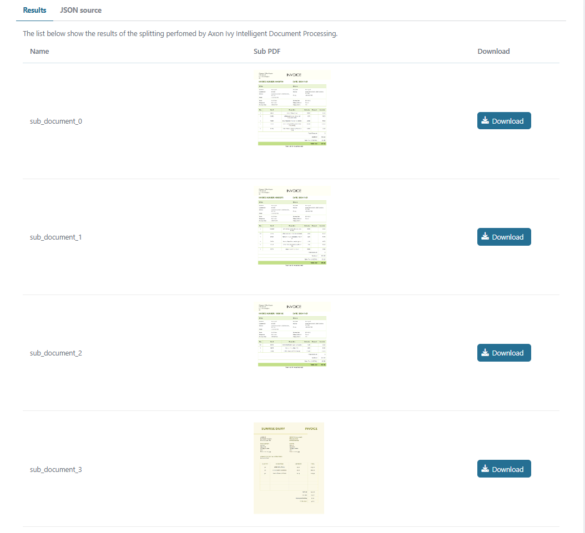

<!--
Dear developer!   

When you create your very valuable documentation, please be aware that this Readme.md is not only published on github. This documentation is also processed automatically and published on our website. For this to work, the two headings "Demo" and "Setup" must not be changed
-->

# AxonIvy IDP Connector

Axon Ivy IDP is an Intelligent Document Processing solution that automates the extraction, classification, and analysis of unstructured data. It streamlines document-intensive processes like invoice management, claims processing, and customer onboarding using AI-driven OCR, handwriting text recognition (HTR), and machine learning algorithms to elevate accuracy and efficiency in data management. This connector:

* gives you access to basic Axon Ivy IDP functions: splitting, extraction.
* has a built-in validation of processing resulit.
* minimizes your integration effort with a UI Standalone component.
* is based on REST web service, Axon Ivy UI Component, SubCallable process technologies.

## Demo

#### Document Splitting

1. Start 'DocumentSplitting'
   
2. Click 'Process' to goto page Document Splitting Review
   
3. Click 'Process' to goto page Document Splitting Result
   
4. Check last log to have the result of validation function
   

#### Extraction

1. Start 'Extraction'
   
2. Select a document from list, then click 'Process' to goto page Extraction Review
   
3. Click 'Process' to goto page Extraction Result
   
4. Click 'Close' to do Validation process and close the demo, then Check last log to have the result of validation function
   

## Setup

Before any interactions between the Axon Ivy Engine and IDP services can be run, they have to be introducted to each other. This can be done as follows:

1. Get a working AxonIvy IDP `API Key` (set in the variable)  - Needed to call REST API services
2. Override the global variable for `apiKeySecret`  in the demo project as shown in the example below.
   
   ```
   Variables:
     idpConnector:
      # The proxy server URL
      apiProxyUrl: 'https://idp.api.axonivy.com'
      # API Key for "IDP Document Capturing API"
      apiKeySecret: ''
   ```
   
   When you use IDP via another proxy server, you need to set `apiProxyUrl`.
   Run `workflows.ivp` of the IDPDemo demo process to test your setup.

