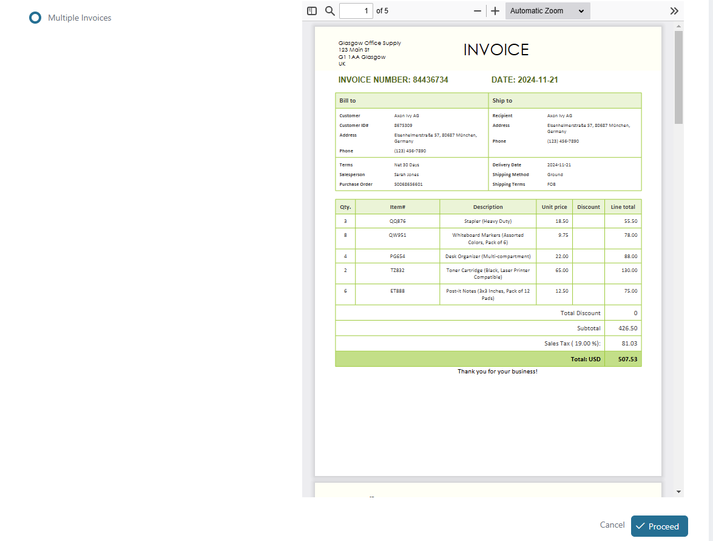
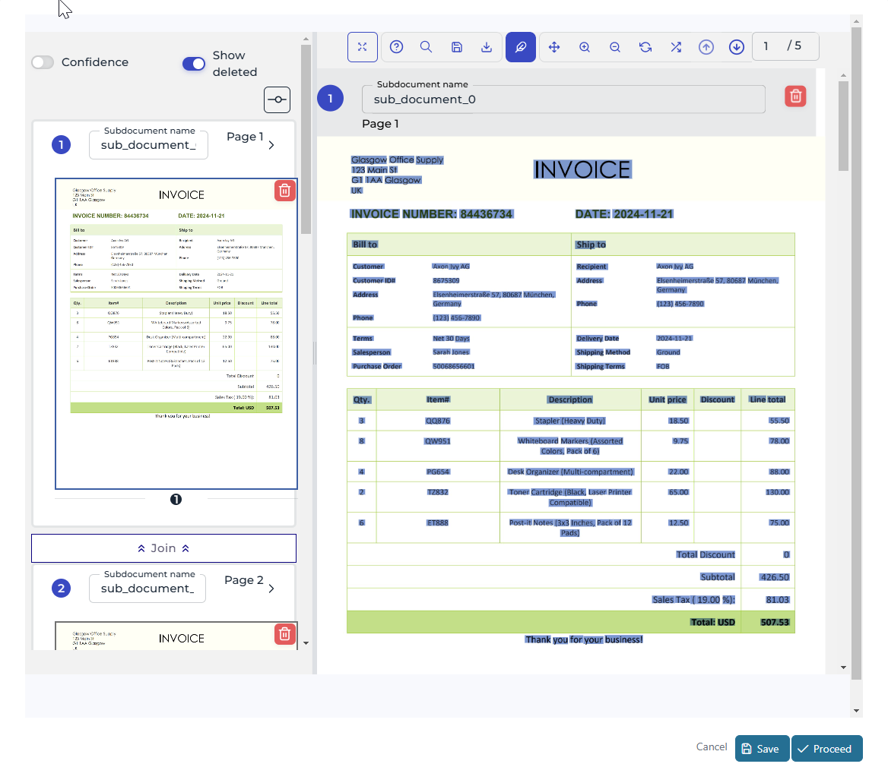
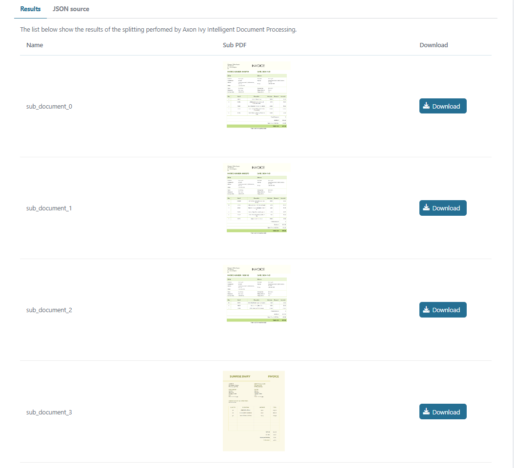
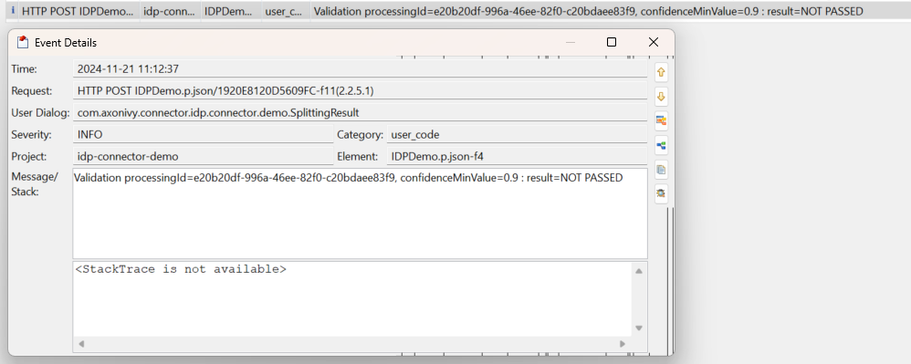
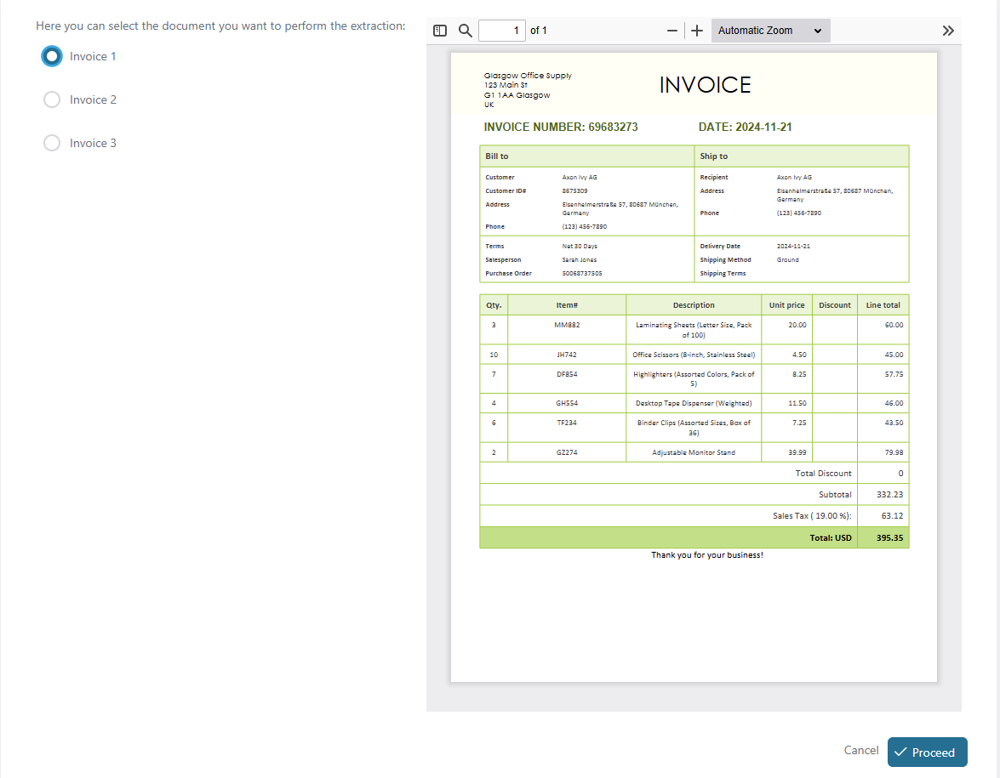
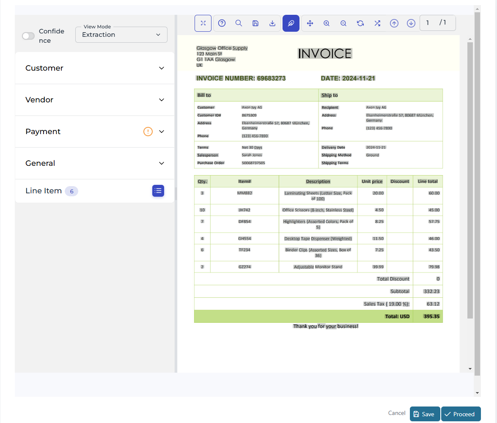
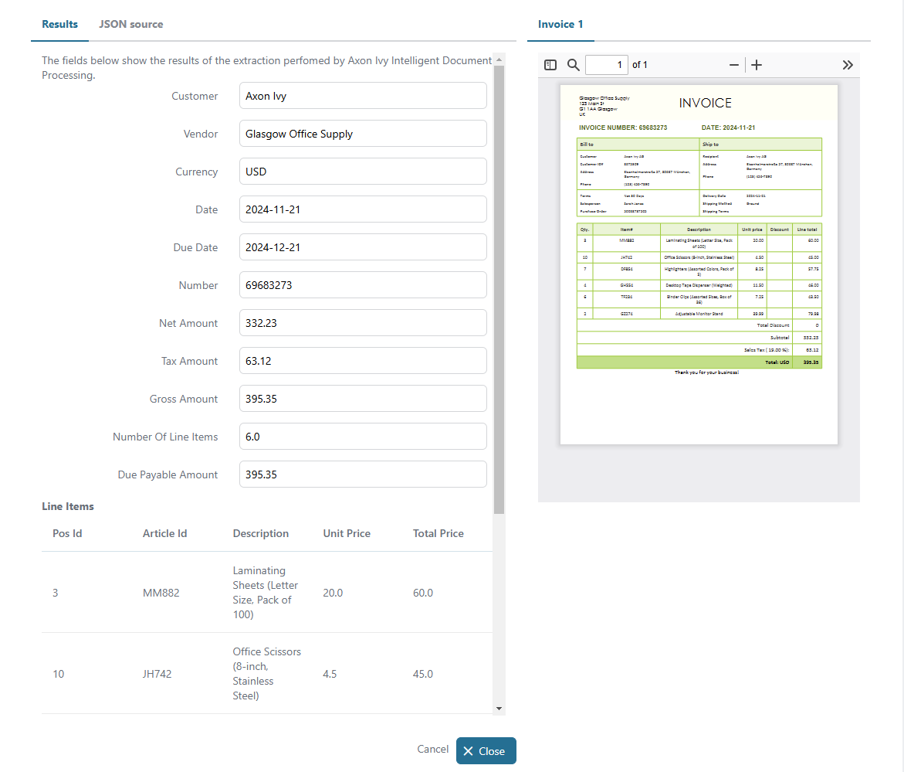
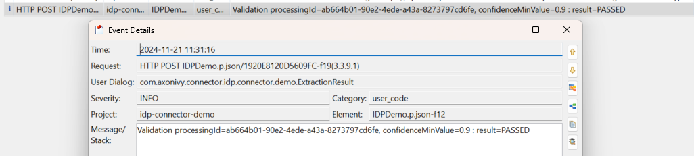

# Axon Ivy IDP Connector

Axon Ivy IDP is an Intelligent Document Processing solution that automates the
extraction, classification, and analysis of unstructured data. It streamlines
document-intensive processes such as invoice management, claims processing, and
customer onboarding using AI-powered OCR, handwriting text recognition (HTR),
and machine learning algorithms to increase the accuracy and efficiency in data
management. This connector:

* gives you access to the Axon Ivy's capabilities: pre processing,
  classification and data extraction.
* has a built-in validation of processing results.
* minimizes your integration effort with a standalone UI component.
* is based on REST web service, Axon Ivy UI Component and SubCallable process
  technologies.

## Demo

### Document Splitting

1. Start 'DocumentSplitting' 
2. Click 'Process' to review the result of the document splitting service
   
3. Click 'Process' to view the result of document splitting and to download the
   individual pages 
4. Check the last log to see the result of the validation function
   

### Extraction

1. Start 'Extraction' 
2. Select a document from the list, then click 'Process' to review the result of
   the extraction 
3. Click 'Process' to view the extraction result
   
4. Check the last log to see the result of the validation function
   

## Setup

Before any interaction between the Axon Ivy Engine and the IDP services can take
place, the following steps must be followed:

1. Get a working Axon Ivy IDP `API Key` by contacting support@axonivy.com - this
   is required to call the REST API services.
2. Override the global variable for `apiKeySecret` in the demo project as shown
   in the example below.

```
@variables.yaml@
```
