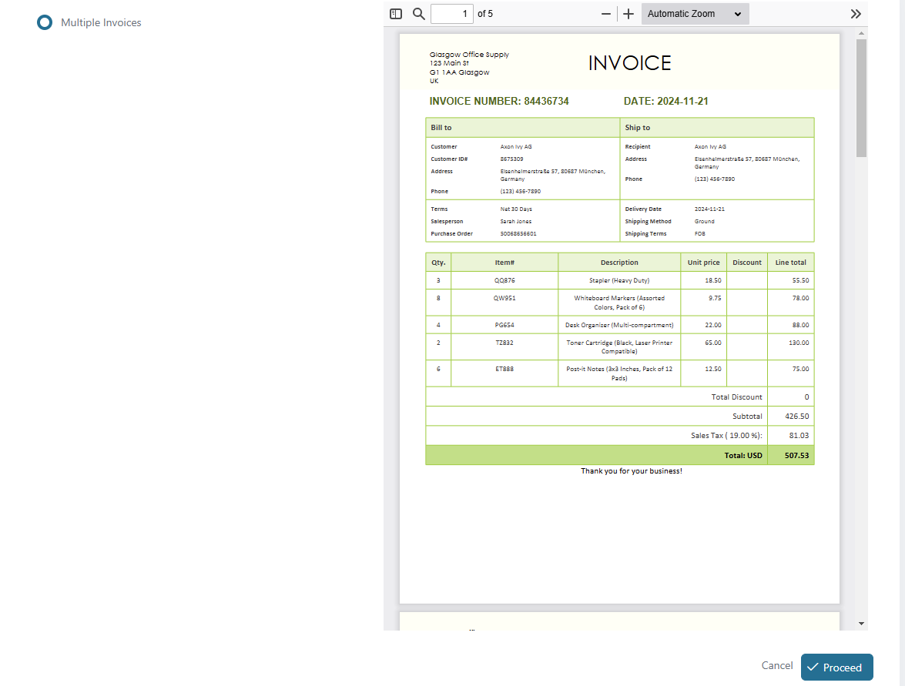
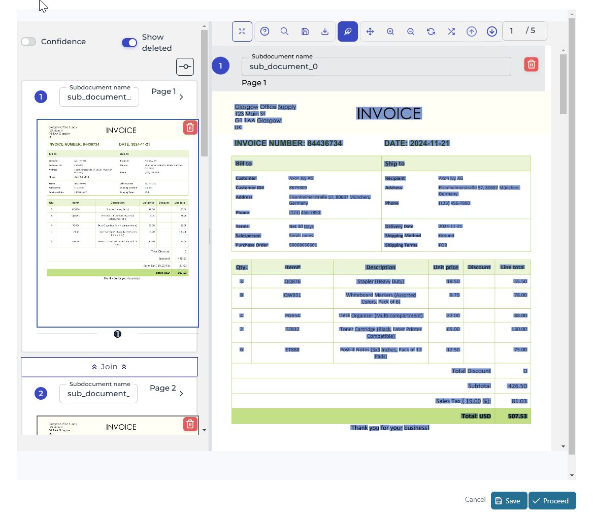
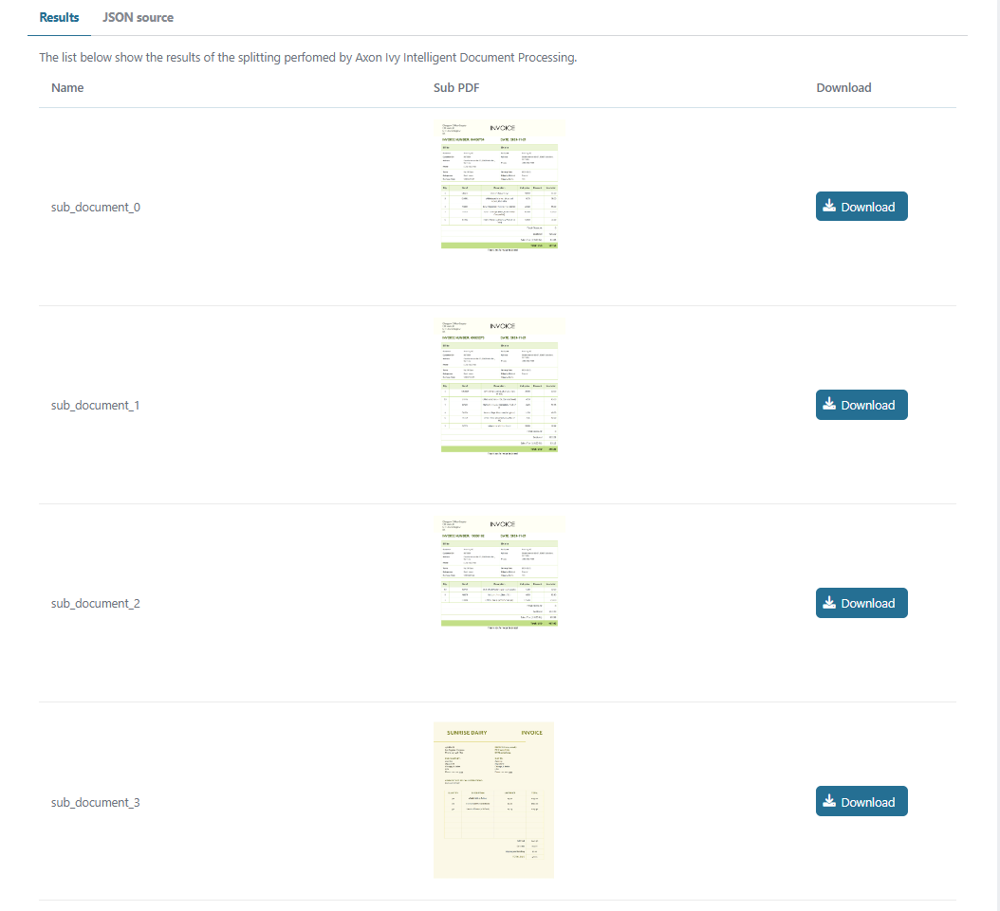
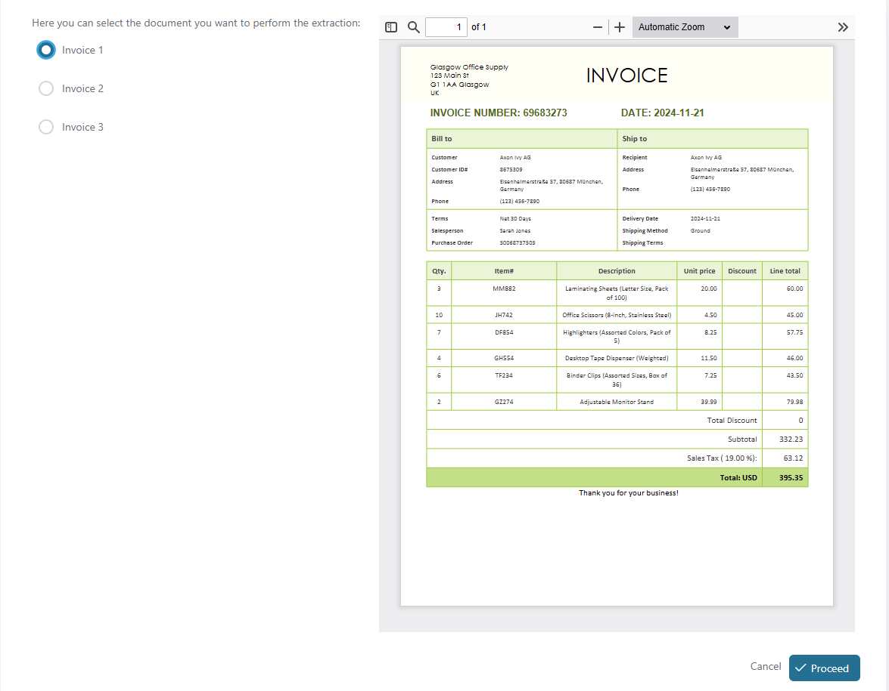
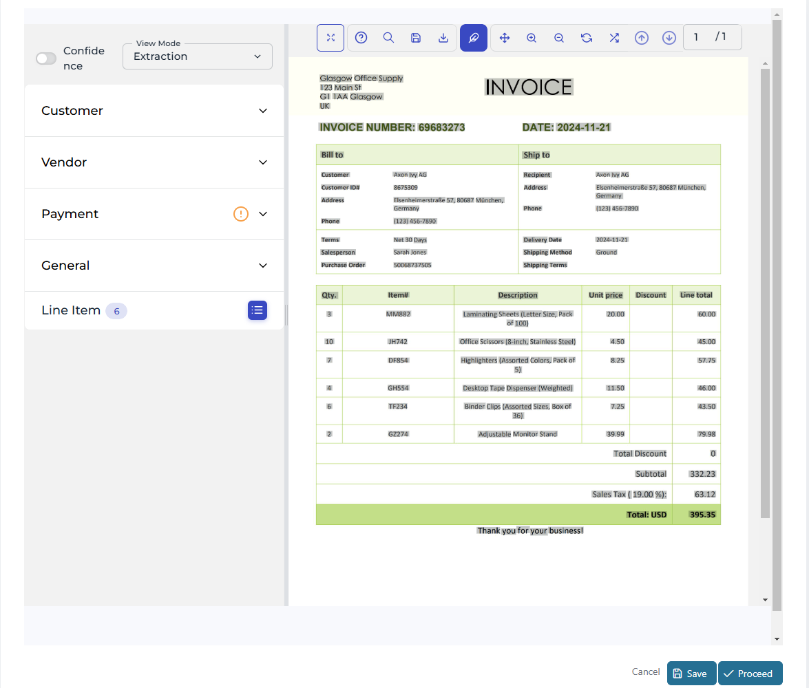
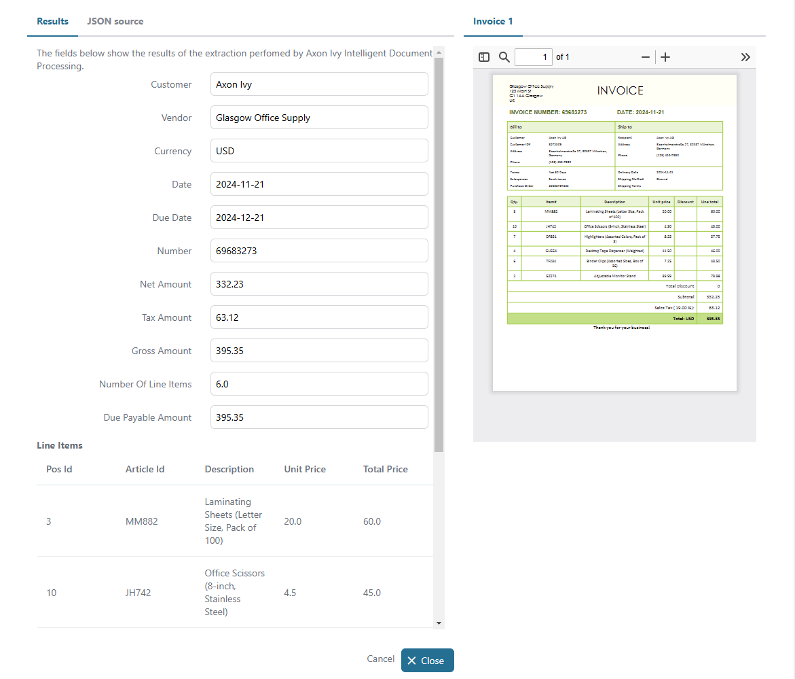

# Axon Ivy IDP Connector

Axon Ivy IDP ist eine leistungsstarke Lösung für Intelligent Document Processing, die die Extraktion, Klassifizierung und Analyse unstrukturierter Daten automatisiert und dokumentenintensive Prozesse in schlanke, effiziente Workflows verwandelt. Der Connector integriert sich in Axon Ivy und bietet Dokumententrennung, automatische Extraktion, Validierung sowie einfache Abrufmöglichkeiten für Verarbeitungsergebnisse. Lies unsere [Dokumentation](idp-connector-product/README.md).

**Wichtigste Funktionen**

- Automatisiere die Extraktion und Klassifizierung von Dokumenten direkt aus deinen Axon Ivy-Prozessen.
- Teile Dokumente in Teil-Dokumente für gezielte Verarbeitung und nachgelagerte Workflows.
- Validiere die Extraktionskonfidenz mit konfigurierbaren Schwellenwerten, um die Datenqualität zu verbessern.
- Rufe Verarbeitungsergebnisse und Vorschaubilder programmgesteuert ab für die Weiterverarbeitung.
- Teile verarbeitete Dokumente sicher mittels kurzlebiger Share-Tokens zur Zusammenarbeit.
- Integriere Funktionen über aufrufbare Unterprozesse, damit Geschäftslogik in deinen Prozessen bleibt.

## Demo

Sieh dir die Demo-Implementierungen im mitgelieferten Demo-Modul an. Die Demos zeigen die Workflows Dokumententrennung und Dokumentextraktion und liefern praktische Beispiele, die du lokal ausführen kannst.

### Demo-Workflows

#### IDP Demo (idp-connector-demo)

##### Dokumententrennung

1. Starte die Demo „Dokumententrennung“ über das Demo-Menü oder die Prozessliste.
2. Es öffnet sich ein Dateiauswahl-Dialog; lade das Dokument hoch oder wähle es aus.



3. Konfiguriere die Trennoptionen (Seitenbereiche) und bestätige.



4. Prüfe die Trenn-Ergebnisse und lade die resultierenden Dateien herunter.



##### Dokumentextraktion

1. Starte die Demo „Dokumentextraktion“ über das Demo-Menü oder die Prozessliste.
2. Wähle oder lade ein Beispiel-Dokument hoch, um strukturierte Daten zu extrahieren.



3. Prüfe die extrahierten Daten und bestätige die Ergebnisse.



4. Optional: Verwende die eigenständige UI, um Extraktionsdetails und Vorschaubilder anzusehen.



## Einrichtung

- **Rollen:** Everybody (konfiguriert in config/roles.xml)
- **OpenAPI:** Für diesen Abschnitt wurden keine Informationen geliefert.

### Variablen

```yaml
@variables.yaml@
```


## Komponenten

### Aufrufbare Unterprozesse

#### ProcessingService.p.json

- **Signature**: processing(String workfowId, java.io.File file) -> processingId: java.util.UUID
    - Eingaben:
        - `workfowId` (String)
        - `file` (java.io.File)
    - Ergebnis:
        - `processingId` (java.util.UUID)
        - `processingResult` (com.fasterxml.jackson.databind.JsonNode)
        - `error` (ch.ivyteam.ivy.bpm.error.BpmError)

- **Signature**: getSubPdf(java.util.UUID processingId, Integer index, String fileName) -> file: java.io.File
    - Eingaben:
        - `processingId` (java.util.UUID)
        - `index` (Integer)
        - `fileName` (String)
    - Ergebnis:
        - `file` (java.io.File)
        - `error` (ch.ivyteam.ivy.bpm.error.BpmError)

- **Signature**: shareToken(java.util.UUID processing_id, String expires_at) -> docShareTokenInfo: com.axonivy.connector.idp.connector.model.DocShareTokenInfo
    - Eingaben:
        - `processing_id` (java.util.UUID)
        - `expires_at` (String)
    - Ergebnis:
        - `docShareTokenInfo` (com.axonivy.connector.idp.connector.model.DocShareTokenInfo)
        - `error` (ch.ivyteam.ivy.bpm.error.BpmError)

- **Signature**: revokeToken(java.util.UUID tokenUUID) -> error: ch.ivyteam.ivy.bpm.error.BpmError
    - Eingaben:
        - `tokenUUID` (java.util.UUID)
    - Ergebnis:
        - `error` (ch.ivyteam.ivy.bpm.error.BpmError)

- **Signature**: retrieveThumbnail(java.util.UUID processingId) -> thumbnail: java.io.File
    - Eingaben:
        - `processingId` (java.util.UUID)
    - Ergebnis:
        - `thumbnail` (java.io.File)
        - `error` (ch.ivyteam.ivy.bpm.error.BpmError)

- **Signature**: retrieveResult(java.util.UUID processingId) -> resultsNode: com.fasterxml.jackson.databind.JsonNode
    - Eingaben:
        - `processingId` (java.util.UUID)
    - Ergebnis:
        - `resultsNode` (com.fasterxml.jackson.databind.JsonNode)
        - `error` (ch.ivyteam.ivy.bpm.error.BpmError)

#### ValidationService.p.json

- **Signature**: validate(java.util.UUID processingId, Double confidenceMinValue) -> passed: Boolean
    - Eingaben:
        - `processingId` (java.util.UUID)
        - `confidenceMinValue` (Double)
    - Ergebnis:
        - `passed` (Boolean)
    - Beschreibung: validate all values have confident >= confidentThreshold or NOT
### Dialogkomponenten

#### IDPStandaloneUI — Wiederverwendbare Formularkomponente

- **Namespace:** com.axonivy.connector.idp.connector.IDPStandaloneUI
- **Komponententyp:** Component dialog
- **Felder:**
   - `documentId` (java.util.UUID) — The document Id
   - `workflowType` (com.axonivy.connector.idp.connector.WorkflowType) — The document's workflow type: 'document-splitting' OR 'extraction'. Default is 'extraction'.
- **Zweck:** Error when getting the sharing url
- **UI attributes:**
   - `widgetVar` (required) — widgetvar. Use to save the form data: PF('{widgetvar}').save();
   - `style` (java.lang.String) (default: width:100%;height:85vh;border:0;) — style for the component itself
   - `styleClass` — styleClasses for the div surrounding the iframe
### Web-Services

- Es wurden keine Informationen für diesen Abschnitt geliefert.
### Maven-Artefakte

1. idp-connector

```xml
<dependency>
  <groupId>com.axonivy.connector.idp</groupId>
  <artifactId>idp-connector</artifactId>
  <type>iar</type>
</dependency>
```

2. idp-connector-demo

```xml
<dependency>
  <groupId>com.axonivy.connector.idp</groupId>
  <artifactId>idp-connector-demo</artifactId>
  <type>iar</type>
</dependency>
```
